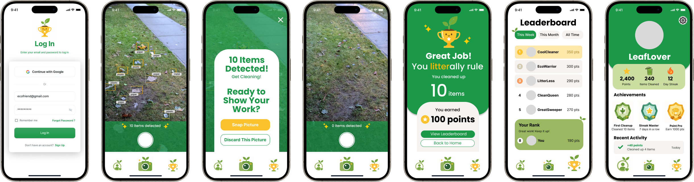

## 🏆 ClubHacks Winner - Best Use of Gemini (GDG Partner Prize)
See the DevPost here: https://devpost.com/software/pureleaf

## Demo
https://www.youtube.com/watch?v=Es1p-tzcCZs

## Inspiration 🌱
Litter is a problem that everyone notices, and yet few people feel motivated to act on. You might walk past some garbage outdoors and think, "someone else will deal with it". PureLeaf changes this psychology by making cleanup feel rewarding and competitive.
Games like Duolingo and Strava have proven that streaks and leaderboards can turn mundane habits into addictive ones. I wanted to capitalize on this in a way that benefits everyone: making cleaning up our neighborhoods fun and competitive.

## Figma Mock-Ups

## What it does
PureLeaf is a mobile app that gamifies litter cleanup using AI. Here's the core loop:
* **Scan**: Point your camera at a littered area to take a "before" photo. Gemini AI instantly detects and counts every piece of litter in the frame, labeling each item by type. (plastic bottle, paper cup, etc.)
* **Clean**: Go pick it up.
* **Verify**: Take an "after" photo of the same spot. The app calculates how much litter is gone.
* **Earn**: You're awarded points based on how much you cleaned, with bonuses for bigger hauls and streaks.
* **Compete**: A live leaderboard ranks cleaners by points across weekly, monthly, and all-time periods.

## Tech Stack
* **React-native + Expo Go** for cross-platform mobile app development
* **Google Gemini 2.5 Flash API** for litter detection
* **TypeScript** for frontend/backend

The AI detection pipeline works by sending a base64-encoded JPEG to Gemini with a structured prompt that forces a JSON response containing the item count, individual item labels, and confidence levels.

## Challenges
* Initial setup: As usual, setting up the actual application proved to be one of the hardest parts. I initially had a lot of mismatched dependencies since the Expo Go ios app is running on SDK 54 rather than 55. Fixing these dependencies took some work, but eventually, it worked out!
* Real-time image detection: Another challenge was integrating real-time image detection in a way that felt fast and responsive. Balancing accuracy with speed (especially considering this hackathon's length) required simplifying parts of the detection pipeline. Originally, I started off by training a litter-detection model using TensorFlow, but I quickly realized that I had no idea how to integrate the model within the application. Thus, I opted to use Gemini for image detection instead due to the time constraints.

## Accomplishments 
* Created my first mobile app! And had a lot of fun designing and implementing the Figma mock-ups in a new environment.

## What's next for PureLeaf 🌿
* Persistent database storage
* User authentication (never got to use my pretty log-in screen...)
* More gamification! Levels, events, friend circles, etc.
